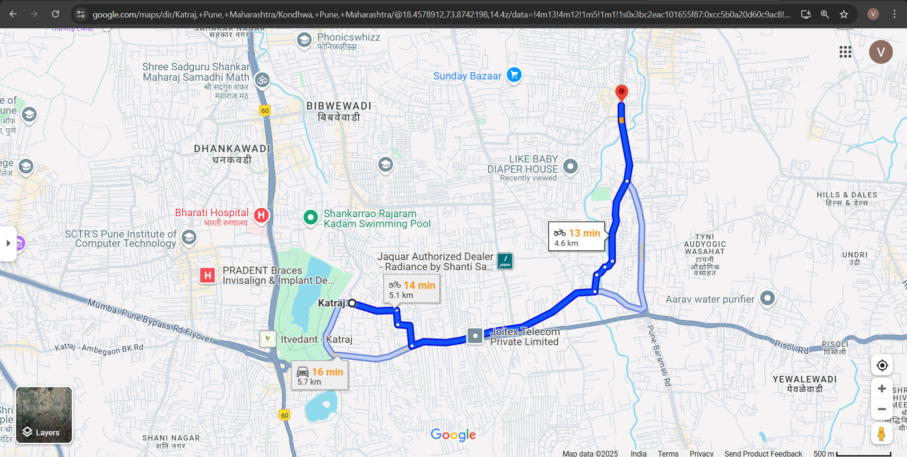
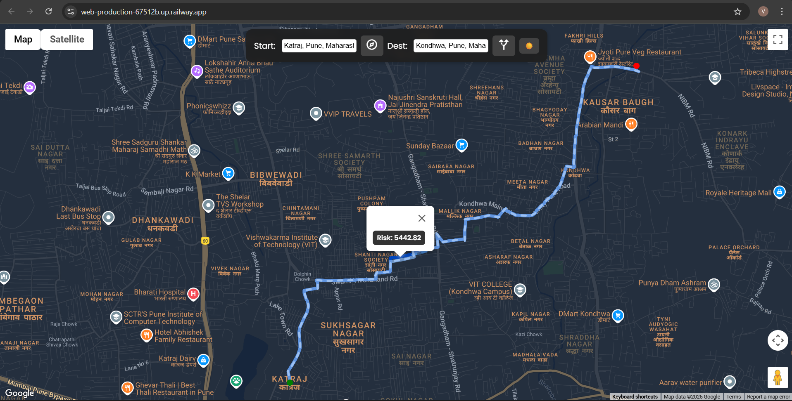

# Sheltr 🛟 – Safety-First Evacuation Router

Sheltr is a Python 3.11+ reference project that computes *safest* routes during natural-disaster evacuations. Instead of minimising travel time, Sheltr assigns **risk scores** to every road segment (blocked roads, proximity to flood zones, etc.) and finds the path with minimal accumulated risk.

---

## Features

🔸 OSM-based street network automatically downloaded for requested area  
🔸 Pluggable risk-scoring pipeline (flood zones, landslides, blockages)  
🔸 `/route` API returns safest path polyline + total risk  
🔸 `/riskmap` API returns GeoJSON heatmap of edge-level risk  
🔸 Stateless Flask backend – can be containerised or serverless  
🔸 Extensible: replace the toy random risk generator with real GeoTIFF layers or live sensor data

---

## Live Demo 🚀

Try Sheltr without installing anything:

[https://sheltr.up.railway.app](https://sheltr.up.railway.app)

---

## Quickstart

```bash
# 1. Clone & install deps (ideally inside venv)
python -m venv .venv && source .venv/bin/activate
pip install -r requirements.txt

# 2. Run the API
python -m Sheltr.backend.app  # listens on :8000

# 3. Example: fetch safest route (Bangalore MG Road → Lalbagh)
curl "http://localhost:8000/route?start=12.9753,77.6065&end=12.9507,77.5848"
```

---

## Simulating Risk Data 🧪

If you lack real hazard datasets, the default implementation assigns a deterministic random risk ∈ [0,1] scaled by road length. To prototype more realistic scenarios:

1. Create `backend/data/hazard_zones.geojson` with polygons for flood/quake zones.  
2. Replace `routing._build_graph` risk logic with intersection tests between each edge `LineString` and polygons, assigning higher risk where they overlap.

---

## File Structure

```
Sheltr/
├── backend/
│   ├── __init__.py         # declares package
│   ├── app.py              # Flask API
│   ├── routing.py          # graph build + risk routing
│   └── data/               # optional hazard GeoJSON / rasters
├── requirements.txt
└── README.md
```

---

## Customising Risk Factors

Open `backend/routing.py` and tweak:

* `RISK_FACTOR_WEIGHT` – amplify or dampen risk penalisation.
* `_build_graph` – plug your hazard layers, live blockage feeds, or structural-integrity scores. Compute `risk_score ∈ [0,1]` for each edge then set `edge["risk_weight"] = length * (1 + weight * risk_score)`.

The router uses NetworkX shortest-path with these weights.

---

## Web Frontend (Google Maps)

The Flask backend now serves a modern Google Maps UI at `/` (see `backend/templates/index.html`).

Features:
* Light/dark theme toggle
* “Use my location” and Places Autocomplete for start/destination inputs
* Risk layer overlay drawn from `/riskmap`
* Multi-route display with colour coding

No extra build step—just run the API (see Setup) and open `http://localhost:8000` in your browser.

---

## Route Comparison

Below is an example of how Sheltr’s risk-aware routing differs from the standard shortest-time route returned by Google Maps for the **same start and destination**.

| Google Maps | Sheltr (safest) |
|-------------|-----------------|
|  |  |

Sheltr deliberately detours around high-risk flood zones (red polygons in the UI), resulting in a slightly longer path that stays on safer, higher-ground roads.

---


## Local Setup

```bash
# 1. Clone & enter project
 git clone https://github.com/kswayam47/sheltr.git && cd sheltr

# 2. Create virtual environment (Python 3.11+ recommended)
 python -m venv .venv && source .venv/bin/activate   # Windows: .venv\Scripts\activate

# 3. Install dependencies
 pip install -r requirements.txt

# 4. Provide a Google Maps JavaScript API key
 echo "GMAPS_API_KEY=YOUR_KEY_HERE" > .env            # or set environment variable

# 5. Run the app (Flask dev server)
 python -m backend.app  # listens on http://127.0.0.1:8000/

# 6. Open the browser
 open http://localhost:8000    # or navigate manually
```

On first run Sheltr downloads the OpenStreetMap network for your AOI (specified via env vars `SHELTR_NORTH/SOUTH/EAST/WEST`). Subsequent runs load the cached graph.

---

## Deployment

Sheltr is stateless; scale horizontally behind a load-balancer. Set environment vars `SHELTR_NORTH/SOUTH/EAST/WEST` to cache a pre-computed network covering your AOI.

```bash
SHELTR_NORTH=13.1 SHELTR_SOUTH=12.8 SHELTR_EAST=77.8 SHELTR_WEST=77.4 \
    gunicorn -m Sheltr.backend.app:app -b 0.0.0.0:8000 -w 4
```

---

## License

MIT © 2025 Sheltr Contributors
